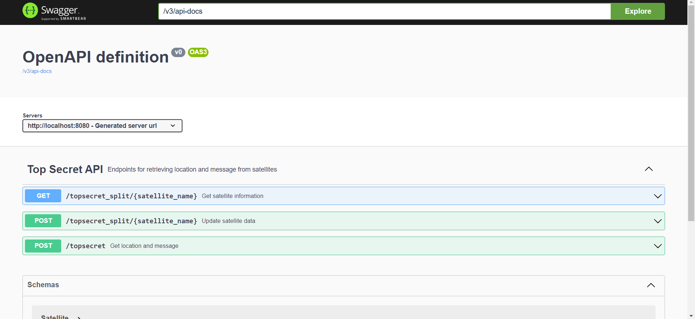

# API REST Meli Challenge

Este proyecto es una API REST construida con Spring Boot en el lenguaje de programación Kotlin. La API se encarga de recibir y procesar información de satélites para determinar la posición y mensaje de una nave enemiga utilizando el método de trilateración.

## Cómo usar

El proyecto contiene un controlador `TopSecretController` que maneja las solicitudes para determinar la ubicación de la nave y obtener el mensaje secreto. La aplicación está alojada en `http://35.202.30.49:8080` y el servidor se encuentra encendido permanentemente, por lo que se puede acceder a cualquiera de sus endpoints en cualquier momento.

## Endpoints

### POST /topsecret

Este endpoint recibe información de tres satélites (Kenobi, Skywalker y Sato) que están en las posiciones (-500, -200), (100, -100) y (500, 100) respectivamente, y devuelve la posición de la nave enemiga y el mensaje que emitió. La información de los satélites se envía en el cuerpo de la petición como un objeto JSON con el siguiente formato:

```json
{
  "satellites": [
    {
      "name": "kenobi",
      "distance": 150.0,
      "message": ["", "este", "es", "un", "mensaje"]
    },
    {
      "name": "skywalker",
      "distance": 238.0,
      "message": ["Hola", "este", "", "un", ""]
    },
    {
      "name": "sato",
      "distance": 176.0,
      "message": ["", "", "es", "un", "mensaje"]
    }
  ]
}
```

El atributo `name` indica el nombre del satélite, `distance` indica la distancia entre el satélite y la nave enemiga, y `message` es un arreglo de strings que representa el mensaje que emitió el satélite.

El endpoint devuelve un objeto JSON con la siguiente estructura:

```json
{
  "position": {
    "x": -58.31525292742582,
    "y": -69.55141837312177
  },
  "message": "este es un mensaje"
}
```

Donde `position` es un objeto que representa la posición de la nave enemiga con las coordenadas `x` e `y`, y `message` es un string que representa el mensaje que emitió la nave enemiga.

### POST /topsecret_split/{satellite_name}

Este endpoint recibe información de un satélite específico (Kenobi, Skywalker o Sato) que se encuentra en una posición conocida y actualiza la información del mismo. El nombre del satélite se proporciona como un parámetro en la URL, y la información del satélite se envía en el cuerpo de la petición como un objeto JSON con el siguiente formato:

```json
{
  "distance": 150.0,
  "message": ["", "este", "es", "un", "mensaje"]
}
```

El atributo `distance` indica la distancia entre el satélite y la nave enemiga, y `message` es un arreglo de strings que representa el mensaje que emitió el satélite.

### GET /topsecret_split

Este endpoint devuelve la posición de la nave enemiga y el mensaje que emitió, utilizando la información de los sat

élites recibida previamente a través del endpoint `POST /topsecret_split/{satellite_name}`. El endpoint no recibe información en el cuerpo de la petición y devuelve un objeto JSON con la siguiente estructura:

```json
{
  "position": {
    "x": -58.31525292742582,
    "y": -69.55141837312177
  },
  "message": "este es un mensaje"
}
```

Si la información de los satélites no es suficiente para determinar la posición y mensaje de la nave enemiga, el endpoint devuelve un error 404 Not Found.

## Consideraciones

- La clase `TopSecretRequest` explicita el formato del cuerpo aceptado en la solicitud. Debe contener una lista de los satélites conocidos y el mensaje secreto tal como lo recibió cada satélite.
- La clase `TopSecretResponse` explicita el formato de la respuesta que devuelve la API REST. Contiene la ubicación de la nave y el mensaje secreto descifrado.
- La clase `Satellite` representa un satélite y contiene su nombre, su distancia a la nave y un fragmento del mensaje secreto.
- La clase `Coordinates` representa las coordenadas que permiten ubicar una nave en un plano cartesiano bidimensional.
- La enumeración `SatelliteName` contiene los nombres de los tres satélites que forman parte de los recursos y que se utilizan para encontrar la nave enemiga y reconstruir el mensaje.
- El método `getLocation()` de la clase `SatelliteService` calcula la ubicación de la nave a partir de la distancia a cada uno de los tres satélites conocidos. Si no se proporciona la distancia a alguno de los tres satélites, devuelve `null`.
- El método `getMessage()` de la clase `SatelliteService` descifra el mensaje secreto a partir de los fragmentos proporcionados por cada uno de los tres satélites conocidos. Si no se proporciona el fragmento de mensaje de alguno de los tres satélites, devuelve una cadena vacía.
- El método `processTopSecret` de la clase `TopSecretController` recibe a traves del body de una request la distancia a la que cada satelite detectó el mensaje así como la fracción del mensaje que pudo interceptar cada uno. Con esta información y aplicando el método de la trilateración que nos provee `getLocation()` obtiene las coordenadas de ubicación del enemigo. También usando el método `getMessage()` logra reconstruir el mensaje enviado por el enemigo. Ambos datos son retornados en la response.
- El método `postSplitSatellite()` de la clase `TopSecretController` registra la distancia y el fragmento del mensaje secreto de un satélite específico. Si el satélite no está registrado, devuelve un mensaje de error.
- El método `getSplitSatellite()` de la clase `TopSecretController` devuelve la ubicación y el fragmento del mensaje secreto de un satélite específico. Si el satélite no está registrado, devuelve un mensaje de error. Si no se proporcionan suficientes fragmentos de mensaje, devuelve un mensaje de error.

## Otras consideraciones:

El challenge estaba dividido en **3 niveles.** Su resolución también fue por niveles y se puede acceder a cada uno de ellos haciendo **checkout entre las ramas del repositorio:**

- **"Main"** es la rama del nivel 3.
- **"Nivel 2"** es la rama del nivel 2.
- Para el nivel 1 hay doy ramas: **"Nivel1"** que es la primera solución (sin clases y objetos) y una segunda versión **"Nivel1_with_class"** que es la misma solución pero con una arquitectura mas compleja que involucra clases y data clases.

Finalmente pueden encontrar la consigna que se debía cumplir en este Meli Challenge Kotlin en el archivo en la carpeta raiz del repo llamado: **"Consgina Challenge - Operacion Fuego de Quasar v1.1 KOTLIN.pdf"**

## Ejemplos de cURL para importar en Postman, Thunder Client o cualquier otro software de cliente:

### POST /topsecret

```json
curl --location 'http://35.202.30.49:8080/topsecret' \
--header 'Content-Type: application/json' \
--data '{
"satellites": [
{
"name": "kenobi",
"distance": 100,
"message": ["", "", "un", "mensaje", ""] },
{
"name": "skywalker",
"distance": 215.5,
"message": ["", "es", "", "", "secreto"] },
{
"name": "sato",
"distance": 342.7,
"message": ["este", "", "un", "", ""] }
]
}'
```

### POST /topsecret_split/{satellite_name}

```json
curl --location 'http://35.202.30.49:8080/topsecret_split/keno' \
--header 'Content-Type: application/json' \
--data '{
"distance": 557.0,
"message": ["Este es", "un mensaje","para" , "probar", "si funciona"]
}'
```

### GET /topsecret_split

```json
curl --location 'http://35.202.30.49:8080/topsecret_split/sato'
```

## Extra:

Podes obtener estas request y otras tres que forman parte de una misma colection de testeo de los endpoints en http://localhost:8080 descargando el el siguiente .JSON de este repo:

**API-REST Meli Challenge.postman_collection.json**

Una vez descargado lo importan en Postman y listo!

Importante: para probarlo en local host primero vas a tener que clonar el repositorio actual en tu PC

```bash
git clone https://github.com/Mgobeaalcoba/api_rest_meli_challenge_public.git
```

luego ubicarte en el directorio clonado y compilarlo con el siguiente comando:

```bash
./gradlew build
```

Una vez compilado, se debe ejecutar el archivo .jar generado por la compilación con el siguiente comando:

```bash
java -jar build/libs/{mi-programa}.jar
```

Hay que reemplazar {mi-programa} por el nombre que el compilador le haya puesto en tu PC.

Hecho esto tendrás el servidor levantado en localhost y podrás probarlo también allí.

## Documentación interactiva (**_NEW_**):

Al descargar el proyecto y encender el servidor podrán encontrar la documentación intereactiva del mismo en el siguiente dominio:

- http://localhost:8080/swagger-ui/index.html#/



Desde allí no solo podrán entender la función del controlador y de cada uno de sus endpoints sino que también podrán probarlos desde allí mismo.

También podrán encontrar la misma documentación accediendo desde el server en linea.

---

## Autor

Dev: Mariano Gobea Alcoba

Email: gobeamariano@gmail.com

LinkedIn: [Mariano Gobea Alcoba](https://www.linkedin.com/in/mariano-gobea-alcoba)

GitHub: [Mgobeaalcoba](https://github.com/Mgobeaalcoba)

---
